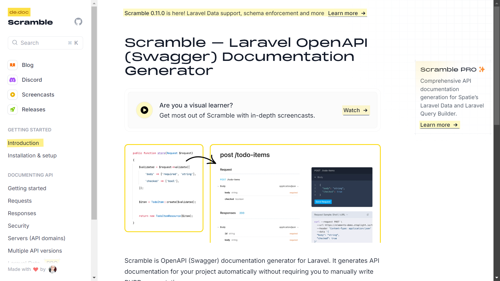

# Scramble Dedoc



[https://scramble.dedoc.co/](https://scramble.dedoc.co/)

## Step by Step

### Install Anything

- Install Laravel
    
    ```bash
    composer global require laravel/installer
    
    laravel new example-app
    ```
    
    
    
    Fyi:
    
    - I choose none starter kit because I don’t need this for now.
    - Using Pest for testing framework, I think it’s good.
    
    
    
    Using sqlite because lazy to create new DB in mysql
    
    
    
    Done
    
    
    
- Install Dedoc Scramble
    
    ```bash
    composer require dedoc/scramble
    ```
    
    
    
    After install, you can open this
    
    
    
- Install API
    
    In Laravel 11, you must install api first. But, you’ll automatically install Laravel Sanctum after install api.
    
    ```bash
    php artisan install:api
    ```
    
    
    
    
    

### CRUD Product API

This step can be 

### Example

- Index
    
    ```php
    /**
     * Display a listing of the resource.
     */
    public function index()
    {
        try {
            $books = Book::query()
            ->get();
    
            return response()->json([
                'status_code' => 200,
                'message' => 'Get all book',
                'data' => $books,
            ]);
    
        } catch (\Throwable $th) {
            return response()->json([
                'status_code' => $th->getStatusCode(),
                'message' => $th->getMessage(),
                'data' => $th->getMessage(),
            ]);
        }
    }
    ```
    
    
    
    
    
- Show
    
    ```php
    /**
     * Display the specified resource.
     */
    public function show(Book $book)
    {
        try {
            return response()->json([
                'status_code' => 200,
                'message' => 'Get book',
                'data' => $book,
            ]);
        } catch (\Throwable $th) {
            return response()->json([
                'status_code' => $th->getStatusCode(),
                'message' => $th->getMessage(),
                'data' => $th->getMessage(),
            ]);
        }
    }
    ```
    
    
    
    
    
    
    
- Delete
    
    ```php
      /**
       * Remove the specified resource from storage.
       */
      public function destroy(Book $book)
      {
          try {
              $book->delete();
              return response()->json([
                  'status_code' => 200,
                  'message' => 'Delete book',
              ]);
          } catch (\Throwable $th) {
              return response()->json([
                  'status_code' => $th->getStatusCode(),
                  'message' => $th->getMessage(),
              ]);
          }
      }
    ```
    
    
    
- Create
    
    
    
    
    
    
    
- Update
    
    ```php
    /**
     * Update the specified resource in storage.
     */
    public function update(UpdateBookRequest $request, Book $book)
    {
        try {
            $book->update($request->validated());
    
            return response()->json([
                'status_code' => 200,
                'message' => 'Successfully update data!',
                'data' => $book,
            ]);
    
        } catch (\Throwable $th) {
            return response()->json([
                'status_code' => $th->getStatusCode(),
                'message' => $th->getMessage(),
                'data' => $th->getMessage(),
            ]);
        }
    }
    ```
    
    
    
    
    

### Using Sanctum

[https://laravel.com/docs/11.x/sanctum#issuing-mobile-api-tokens](https://laravel.com/docs/11.x/sanctum#issuing-mobile-api-tokens)

```php
/**
 * Login via API
 */
public function login (Request $request) {

    $request->validate([
        'email' => 'required|email',
        'password' => 'required',
    ]);

    $user = User::where('email', $request->email)->first();

    // return $user;

    if (! $user || ! Hash::check($request->password, $user->password)) {
        throw ValidationException::withMessages([
            'email' => ['The provided credentials are incorrect.'],
        ]);
    }

    return $user->createToken(now()->toTimeString())->plainTextToken;
}
```


If failed

### Using Security Sanctum in Scramble Dedoc

```php
/**
 * Bootstrap any application services.
 */
public function boot(): void
{
    Scramble::afterOpenApiGenerated(function (OpenApi $openApi) {
        $openApi->secure(
            SecurityScheme::http('bearer')
        );
    });
}
```


Example using bearer token


If didn’t use bearer token
